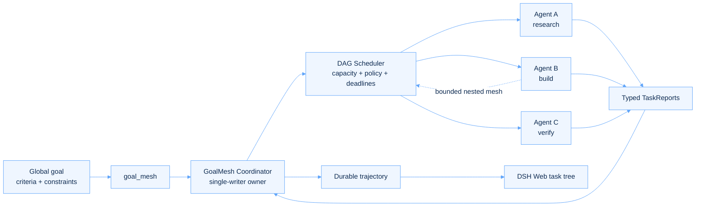

<p align="center">
  <a href="README.md">English</a>
  ·
  <a href="README.zh-CN.md">简体中文</a>
</p>

<p align="center">
  
</p>

<p align="center">
  <strong>Goal-driven multi-agent orchestration for DeepSeek Harness.</strong><br />
  Turn one objective into a bounded agent graph—and keep every decision, dependency, and result observable.
</p>

<p align="center">
  <a href="https://github.com/Jarad-z/dsh-goalmesh/actions/workflows/ci.yml"></a>
  <a href="https://github.com/deepseek-ai/deepseek-harness"></a>
  
  
  <a href="LICENSE"></a>
  <a href="https://github.com/topics/dsh-plugin"></a>
</p>

<p align="center">
  <a href="#why-goalmesh">Why</a> ·
  <a href="#how-it-works">How it works</a> ·
  <a href="#capabilities">Capabilities</a> ·
  <a href="#tool-protocol">Protocol</a> ·
  <a href="#development">Development</a>
</p>

---

## One goal in. A coordinated mesh out.

DSH GoalMesh is a [DeepSeek Harness](https://github.com/deepseek-ai/deepseek-harness)
Plugin that exposes one model-facing tool: **`goal_mesh`**. It validates a declarative
task DAG, launches bounded specialist agents, propagates typed dependency results,
supports nested decomposition, and renders the full execution trajectory in DSH Web.

<table>
  <tr>
    <td width="33%" valign="top">
      <h3>01 · Goal-native</h3>
      <p>Every agent receives the immutable global goal, a focused objective, and explicit acceptance criteria.</p>
    </td>
    <td width="33%" valign="top">
      <h3>02 · Multi-agent by design</h3>
      <p>DAG scheduling, bounded concurrency, nested delegation, deadlines, and cancellation share one owner.</p>
    </td>
    <td width="33%" valign="top">
      <h3>03 · Evidence-first</h3>
      <p>Typed reports and durable events make live execution and replay explainable from the same task tree.</p>
    </td>
  </tr>
</table>

> [!NOTE]
> GoalMesh is a **DSH Plugin**, not a Codex Plugin. It runs inside the DeepSeek
> Harness Profile and follows Cordis Entry/Fiber lifecycle ownership.

## Why GoalMesh

- **Goal fidelity** — local work remains anchored to the same success criteria and constraints.
- **Structured concurrency** — admission, deadlines, cancellation, failure propagation, and cleanup are bounded by one coordinator.
- **Dependency-aware execution** — tasks start only after prerequisites settle, with explicit `fail`, `skip`, or `partial` behavior.
- **Safe recursive delegation** — child agents can open nested meshes through attempt-fenced, child-scoped leases.
- **Stable typed results** — every child returns a `TaskReport`; task identity and input order remain deterministic.
- **Durable observability** — live events and replay fold into the same Web task tree, including trusted child-Session navigation.

## How it works



The coordinator sits above root and child agents. Children never receive the mutable
run ledger; they operate through revocable leases, so siblings cannot mutate one
another's state. Cordis fibers own every tool registration, listener, service, and live
resource from mount through disposal.

## Capabilities

| Capability | v0.3 |
|---|:---:|
| Foreground bounded parallelism | ✅ |
| Static task DAGs and dependency materialization | ✅ |
| Collect-all, fail-fast, and quorum policies | ✅ |
| Fail, skip, and partial dependency propagation | ✅ |
| Nested local GoalMesh calls | ✅ |
| Parent permit release/reacquire during nested work | ✅ |
| Durable trajectory replay and Web task tree | ✅ |
| Runtime invariant validation | ✅ |
| Detached/background execution | Planned |
| Automatic task retry | Planned |
| Distributed provider-aware capacity | Planned |

## Package layout

| Package | Responsibility |
|---|---|
| `dsh-goalmesh-plugin` | Installable composition bundle and Cordis patch |
| `dsh-tool-goalmesh` | Host tool, coordinator, scheduler, recorder, and invariant companion |
| `dsh-client-ui-goalmesh` | Inert Node entry and DSH Web trajectory client |

```text
dsh-goalmesh/
├─ packages/
│  ├─ goalmesh-plugin/       # bundle + cordis.patch.yml
│  ├─ tool-goalmesh/         # orchestration runtime
│  └─ client-ui-goalmesh/    # durable trajectory UI
├─ docs/                     # architecture and execution contract
├─ harness-patches/          # minimal public Harness prerequisites
└─ tests/                    # coordinator, nesting, replay, UI, invariants
```

The split follows DeepSeek Harness ownership boundaries: Host scheduling works in a
headless Profile, while the installable bundle composes Host, invariant, and Web entries.

## Tool protocol

A root invocation declares one goal and an invocation-local task graph:

```json
{
  "goal": {
    "statement": "Ship a release-ready API migration plan",
    "success_criteria": [
      "Every breaking change has an owner",
      "Rollback and verification steps are explicit"
    ],
    "constraints": [
      "Preserve backward compatibility during rollout"
    ]
  },
  "tasks": [
    {
      "key": "surface",
      "description": "Map the public API surface",
      "objective": "Identify every affected endpoint and consumer",
      "acceptance_criteria": [
        "The inventory is complete and evidence-linked"
      ]
    },
    {
      "key": "rollout",
      "description": "Design the rollout",
      "objective": "Produce staged migration and rollback steps",
      "acceptance_criteria": [
        "Each stage has a measurable gate"
      ],
      "depends_on": ["surface"],
      "dependency_failure": "partial"
    }
  ],
  "failure_mode": "collect_all"
}
```

Nested invocations omit `goal`. Ownership comes from the scoped lease captured by the
Host tool—never from model-provided IDs.

## Development

GoalMesh v0.3 targets DeepSeek Harness `0.1.0-rc.5` at public baseline
`47f943859bef60e4160492346772ded9b24f765a`, plus the minimal runtime patch in
[`harness-patches/goalmesh-prerequisites.patch`](harness-patches/goalmesh-prerequisites.patch).

> [!IMPORTANT]
> Keep `deepseek-harness` and `dsh-goalmesh` as sibling directories. Workspace
> dependencies intentionally resolve against that layout.

```sh
mkdir goalmesh-dev && cd goalmesh-dev
git clone https://github.com/deepseek-ai/deepseek-harness.git
git -C deepseek-harness checkout 47f943859bef60e4160492346772ded9b24f765a
git -C deepseek-harness submodule update --init --recursive
git clone https://github.com/Jarad-z/dsh-goalmesh.git
git -C deepseek-harness apply ../dsh-goalmesh/harness-patches/goalmesh-prerequisites.patch
cd dsh-goalmesh

corepack enable
corepack install --global pnpm@11.7.0
pnpm --dir ../deepseek-harness install --frozen-lockfile
pnpm --dir ../deepseek-harness run build:lib
pnpm install --frozen-lockfile
pnpm check
```

### Useful commands

| Command | Purpose |
|---|---|
| `pnpm build` | Build Host and Web packages |
| `pnpm typecheck` | Check the full TypeScript project graph |
| `pnpm test:unit` | Run the Vitest suite |
| `pnpm lint` | Run oxlint |
| `pnpm check` | Build, test, and lint—the CI contract |

Build artifacts are emitted under `packages/tool-goalmesh/lib/` and
`packages/client-ui-goalmesh/lib/`. The ready-to-compose Profile patch lives at
[`packages/goalmesh-plugin/cordis.patch.yml`](packages/goalmesh-plugin/cordis.patch.yml).

## Design guarantees

- The root tool returns only after its invocation and owned resources settle.
- Unknown model fields and forged ownership identifiers are rejected.
- The global goal is read-only; children report only against local task goals.
- Coordinator transitions are serialized and checked by runtime invariants.
- Durable UI events are observational; the Web client never becomes a second scheduler.
- Provider removal stops new admission without abandoning already-owned cleanup.

Read [the architecture contract](docs/architecture.md) for the complete design. Version
boundaries and implementation order are recorded in [the execution plan](docs/execution-plan.md).

## Contributing

Contributions are welcome. Start with [CONTRIBUTING.md](CONTRIBUTING.md) and run
`pnpm check` before opening a pull request. Report security issues through GitHub's
private vulnerability reporting flow described in [SECURITY.md](SECURITY.md).

<p align="center">
  Released under the <a href="LICENSE">MIT License</a>.<br />
  <sub>Built for explicit goals, bounded agents, and inspectable outcomes.</sub>
</p>
