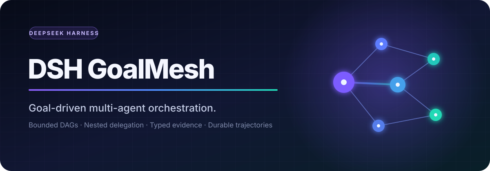
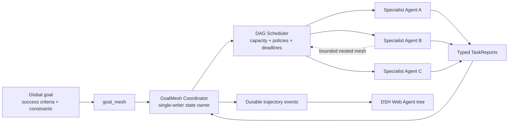

<p align="center">
  
</p>

<p align="center">
  <strong>Goal-driven multi-agent orchestration for DeepSeek Harness.</strong><br />
  Turn one global objective into a bounded task graph, coordinate specialized agents, and keep every result observable.
</p>

<p align="center">
  <a href="https://github.com/Jarad-z/dsh-goalmesh/actions/workflows/ci.yml"></a>
  <a href="https://github.com/deepseek-ai/deepseek-harness"></a>
  
  <a href="LICENSE"></a>
  <a href="https://github.com/topics/dsh-plugin"></a>
</p>

> **One goal in. A coordinated agent mesh out.**

DSH GoalMesh is a DeepSeek Harness Plugin that exposes a single model-facing
`goal_mesh` tool. It validates a declarative task DAG, launches bounded foreground
subagents, propagates typed dependency results, supports nested decomposition, and
renders the complete execution trajectory in the DSH Web client.

## Why GoalMesh

- **Goal fidelity** — every child receives the immutable global goal plus a focused local objective and explicit acceptance criteria.
- **Structured concurrency** — concurrency, deadlines, cancellation, failure propagation, and cleanup stay owned by one coordinator.
- **Dependency-aware execution** — tasks run when their prerequisites settle, with `fail`, `skip`, or `partial` downstream behavior.
- **Bounded recursive delegation** — local children can create nested task graphs through attempt-fenced, child-scoped leases.
- **Evidence-first results** — each child returns a typed `TaskReport`; input order and task identity remain stable.
- **Durable observability** — live events and replay fold into the same Web task tree with trusted child-Session navigation.

## Architecture



The coordinator lives above root and child agents. Children never receive the mutable
run ledger; they operate through revocable leases, so sibling agents cannot mutate one
another's state. Cordis fibers own every tool registration, listener, service, and live
resource from mount through disposal.

## Capability matrix

| Capability | v0.3 |
|---|:---:|
| Foreground bounded parallelism | ✅ |
| Static task DAGs and dependency materialization | ✅ |
| Collect-all, fail-fast, and quorum policies | ✅ |
| Fail, skip, and partial dependency propagation | ✅ |
| Nested local GoalMesh calls | ✅ |
| Parent permit release/reacquire while nested work runs | ✅ |
| Durable trajectory replay and Web task tree | ✅ |
| Runtime invariant validation | ✅ |
| Detached/background execution | Not yet |
| Automatic task retry | Not yet |
| Distributed provider-aware capacity | Not yet |

## Packages

| Package | Responsibility |
|---|---|
| `dsh-goalmesh-plugin` | Installable composition bundle and Cordis patch |
| `dsh-tool-goalmesh` | Host tool, coordinator, scheduler, recorder, and invariant companion |
| `dsh-client-ui-goalmesh` | Inert Node entry plus DSH Web trajectory client |

The split follows DeepSeek Harness ownership boundaries: Host scheduling works in a
headless Profile, while the installable bundle composes Host, invariant, and Web entries.

## Tool protocol

A root invocation declares one goal and an invocation-local task graph:

```json
{
  "goal": {
    "statement": "Ship a release-ready API migration plan",
    "success_criteria": [
      "Every breaking change has an owner",
      "Rollback and verification steps are explicit"
    ],
    "constraints": ["Preserve backward compatibility during rollout"]
  },
  "tasks": [
    {
      "key": "surface",
      "description": "Map the public API surface",
      "objective": "Identify every affected endpoint and consumer",
      "acceptance_criteria": ["The inventory is complete and evidence-linked"]
    },
    {
      "key": "rollout",
      "description": "Design the rollout",
      "objective": "Produce staged migration and rollback steps",
      "acceptance_criteria": ["Each stage has a measurable gate"],
      "depends_on": ["surface"],
      "dependency_failure": "partial"
    }
  ],
  "failure_mode": "collect_all"
}
```

Nested invocations omit `goal`. Ownership comes from the scoped lease captured by the
Host tool, never from model-provided IDs.

## Development

GoalMesh currently targets DeepSeek Harness `0.1.0-rc.5` at baseline commit
`e03b614c7918d6b0337503fa51eebdfeaefcb962`.

```sh
mkdir goalmesh-dev && cd goalmesh-dev
git clone https://github.com/deepseek-ai/deepseek-harness.git
git -C deepseek-harness checkout e03b614c7918d6b0337503fa51eebdfeaefcb962
git clone https://github.com/Jarad-z/dsh-goalmesh.git
cd dsh-goalmesh

corepack enable
corepack install --global pnpm@11.7.0
pnpm install --frozen-lockfile
pnpm check
```

Build artifacts are emitted under `packages/tool-goalmesh/lib/` and
`packages/client-ui-goalmesh/lib/`. To inspect the distributable packages:

```sh
pnpm build
pnpm --dir packages/tool-goalmesh pack
pnpm --dir packages/client-ui-goalmesh pack
pnpm --dir packages/goalmesh-plugin pack
```

The bundle's ready-to-compose Profile patch is
[`packages/goalmesh-plugin/cordis.patch.yml`](packages/goalmesh-plugin/cordis.patch.yml).

## Design guarantees

- The root tool returns only after its invocation and owned resources settle.
- Unknown model fields and forged ownership identifiers are rejected.
- The global goal is read-only; children report only against their local task goals.
- Coordinator state transitions are serialized and checked by runtime invariants.
- Durable UI events are observational; the Web client never becomes a second scheduler.
- Provider removal stops new admission without abandoning already-owned cleanup.

For the complete contract, read [the architecture](docs/architecture.md). The
implementation sequence and version boundaries are recorded in
[the execution plan](docs/execution-plan.md).

## Contributing and security

Contributions are welcome. Start with [CONTRIBUTING.md](CONTRIBUTING.md), and run
`pnpm check` before opening a pull request. Please report security issues through the
repository's private vulnerability reporting flow described in [SECURITY.md](SECURITY.md).

Released under the [MIT License](LICENSE).
