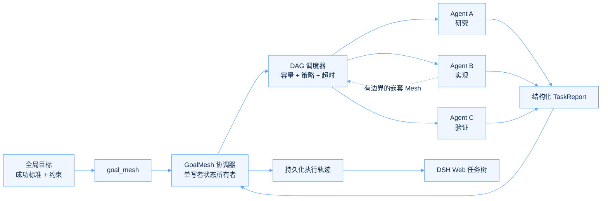

<p align="center">
  <a href="README.md">English</a>
  ·
  <strong>简体中文</strong>
</p>

<p align="center">
  
</p>

<p align="center">
  <strong>面向 DeepSeek Harness 的目标驱动多 Agent 编排。</strong><br />
  把一个全局目标转化为有边界的 Agent 任务图，并让每个决策、依赖和结果都清晰可见。
</p>

<p align="center">
  <a href="https://github.com/Jarad-z/dsh-goalmesh/actions/workflows/ci.yml"></a>
  <a href="https://github.com/deepseek-ai/deepseek-harness"></a>
  
  
  <a href="LICENSE"></a>
  <a href="https://github.com/topics/dsh-plugin"></a>
</p>

<p align="center">
  <a href="#为什么选择-goalmesh">为什么选择</a> ·
  <a href="#运行机制">运行机制</a> ·
  <a href="#能力矩阵">能力矩阵</a> ·
  <a href="#工具协议">工具协议</a> ·
  <a href="#本地开发">本地开发</a>
</p>

---

## 输入一个目标，得到一张协作网络

DSH GoalMesh 是一个 [DeepSeek Harness](https://github.com/deepseek-ai/deepseek-harness)
插件，对模型只暴露一个工具：**`goal_mesh`**。它负责校验声明式任务 DAG、启动数量
受控的专业 Agent、传递结构化依赖结果、支持嵌套任务拆解，并在 DSH Web 中呈现完整的
执行轨迹。

<table>
  <tr>
    <td width="33%" valign="top">
      <h3>01 · 目标原生</h3>
      <p>每个 Agent 都会收到不可变的全局目标、聚焦的局部目标，以及明确的验收标准。</p>
    </td>
    <td width="33%" valign="top">
      <h3>02 · 为多 Agent 而生</h3>
      <p>DAG 调度、并发边界、嵌套委派、超时和取消，全部由同一个协调器管理。</p>
    </td>
    <td width="33%" valign="top">
      <h3>03 · 证据优先</h3>
      <p>结构化报告与持久事件，让实时执行和历史回放都能通过同一棵任务树解释。</p>
    </td>
  </tr>
</table>

> [!NOTE]
> GoalMesh 是 **DSH Plugin**，不是 Codex Plugin。它运行在 DeepSeek Harness
> Profile 中，并遵循 Cordis Entry/Fiber 的生命周期所有权。

## 为什么选择 GoalMesh

- **不偏离全局目标** —— 局部任务始终锚定同一组成功标准和约束，不会因为层层委派而失焦。
- **结构化并发** —— 准入、超时、取消、失败传播和资源清理由一个协调器统一收口。
- **依赖感知调度** —— 前置任务稳定后才会启动下游，并显式支持 `fail`、`skip`、`partial` 三种行为。
- **安全的递归委派** —— 子 Agent 可以通过绑定执行尝试、限定子级作用域的 lease 创建嵌套 GoalMesh。
- **稳定的结构化结果** —— 每个子 Agent 返回 `TaskReport`，任务身份和输入顺序保持确定性。
- **可持久回放** —— 实时事件与历史事件折叠成同一棵 Web 任务树，并支持可信的子 Session 跳转。

## 运行机制



协调器位于根 Agent 和所有子 Agent 之上。子 Agent 永远不会获得可变的运行账本，
而是通过可撤销 lease 工作，因此兄弟 Agent 无法修改彼此状态。Cordis Fiber 从挂载
到释放，全程持有工具注册、监听器、服务和运行中资源。

## 能力矩阵

| 能力 | v0.3 |
|---|:---:|
| 前台有界并行 | ✅ |
| 静态任务 DAG 与依赖结果物化 | ✅ |
| Collect-all、Fail-fast 与 Quorum 策略 | ✅ |
| Fail、Skip 与 Partial 依赖传播 | ✅ |
| 本地嵌套 GoalMesh 调用 | ✅ |
| 嵌套任务期间释放并重新获取父级 permit | ✅ |
| 持久轨迹回放与 Web 任务树 | ✅ |
| 运行时不变量校验 | ✅ |
| 分离式／后台执行 | 规划中 |
| 自动任务重试 | 规划中 |
| 感知 Provider 的分布式容量 | 规划中 |

## 包结构

| 包 | 职责 |
|---|---|
| `dsh-goalmesh-plugin` | 可安装的组合 Bundle 与 Cordis patch |
| `dsh-tool-goalmesh` | Host 工具、协调器、调度器、记录器与不变量伴生插件 |
| `dsh-client-ui-goalmesh` | 惰性 Node 入口与 DSH Web 执行轨迹客户端 |

```text
dsh-goalmesh/
├─ packages/
│  ├─ goalmesh-plugin/       # Bundle + cordis.patch.yml
│  ├─ tool-goalmesh/         # 多 Agent 编排运行时
│  └─ client-ui-goalmesh/    # 持久执行轨迹 UI
├─ docs/                     # 架构与执行契约
├─ harness-patches/          # 最小化公开 Harness 前置补丁
└─ tests/                    # 协调器、嵌套、回放、UI、不变量测试
```

这三个包遵循 DeepSeek Harness 的所有权边界：Host 调度可以运行在无界面的 Profile
中，可安装 Bundle 则把 Host、不变量伴生插件和 Web 入口组合到一起。

## 工具协议

根调用声明一个全局目标，以及本次调用私有的任务图：

```json
{
  "goal": {
    "statement": "交付一份可以进入发布流程的 API 迁移方案",
    "success_criteria": [
      "每项破坏性变更都有明确负责人",
      "回滚与验证步骤清晰可执行"
    ],
    "constraints": [
      "迁移期间保持向后兼容"
    ]
  },
  "tasks": [
    {
      "key": "surface",
      "description": "梳理公开 API 范围",
      "objective": "识别所有受影响的端点与调用方",
      "acceptance_criteria": [
        "清单完整，并附有可追溯证据"
      ]
    },
    {
      "key": "rollout",
      "description": "设计发布流程",
      "objective": "产出分阶段迁移与回滚步骤",
      "acceptance_criteria": [
        "每个阶段都有可量化的准入条件"
      ],
      "depends_on": ["surface"],
      "dependency_failure": "partial"
    }
  ],
  "failure_mode": "collect_all"
}
```

嵌套调用不再传入 `goal`。所有权来自 Host 工具捕获的 scoped lease，而不是模型
提供的任何 ID。

## 本地开发

GoalMesh v0.3 面向 DeepSeek Harness `0.1.0-rc.5`，公开基线提交为
`47f943859bef60e4160492346772ded9b24f765a`，并应用仓库内的最小运行时补丁
[`harness-patches/goalmesh-prerequisites.patch`](harness-patches/goalmesh-prerequisites.patch)。

> [!IMPORTANT]
> 请让 `deepseek-harness` 与 `dsh-goalmesh` 保持为兄弟目录。Workspace 依赖
> 会按照这一目录结构解析。

```sh
mkdir goalmesh-dev && cd goalmesh-dev
git clone https://github.com/deepseek-ai/deepseek-harness.git
git -C deepseek-harness checkout 47f943859bef60e4160492346772ded9b24f765a
git -C deepseek-harness submodule update --init --recursive
git clone https://github.com/Jarad-z/dsh-goalmesh.git
git -C deepseek-harness apply ../dsh-goalmesh/harness-patches/goalmesh-prerequisites.patch
cd dsh-goalmesh

corepack enable
corepack install --global pnpm@11.7.0
pnpm --dir ../deepseek-harness install --frozen-lockfile
pnpm --dir ../deepseek-harness run build:lib
pnpm install --frozen-lockfile
pnpm check
```

### 常用命令

| 命令 | 用途 |
|---|---|
| `pnpm build` | 构建 Host 与 Web 包 |
| `pnpm typecheck` | 检查完整 TypeScript 项目图 |
| `pnpm test:unit` | 运行 Vitest 测试 |
| `pnpm lint` | 运行 oxlint |
| `pnpm check` | 构建、测试、lint，也是 CI 的完整契约 |

构建产物输出到 `packages/tool-goalmesh/lib/` 和
`packages/client-ui-goalmesh/lib/`。可直接组合到 Profile 的 patch 位于
[`packages/goalmesh-plugin/cordis.patch.yml`](packages/goalmesh-plugin/cordis.patch.yml)。

## 设计保证

- 根工具只会在本次调用及其持有的资源全部稳定后返回。
- 未知模型字段和伪造的所有权标识会被拒绝。
- 全局目标只读；子 Agent 仅针对自己的局部任务目标提交报告。
- 协调器状态转换串行执行，并由运行时不变量持续检查。
- 持久 UI 事件只负责观测；Web 客户端永远不会成为第二个调度器。
- Provider 被移除后会停止新任务准入，但不会放弃已经持有的清理责任。

完整设计请阅读[架构契约](docs/architecture.md)，版本边界和实现顺序记录在
[执行计划](docs/execution-plan.md)中。

## 参与贡献

欢迎贡献。提交 Pull Request 前请先阅读 [CONTRIBUTING.md](CONTRIBUTING.md)，
并运行 `pnpm check`。安全问题请通过 GitHub 私密漏洞报告流程提交，具体方式见
[SECURITY.md](SECURITY.md)。

<p align="center">
  基于 <a href="LICENSE">MIT License</a> 发布。<br />
  <sub>为明确的目标、有边界的 Agent，以及可检查的结果而构建。</sub>
</p>
